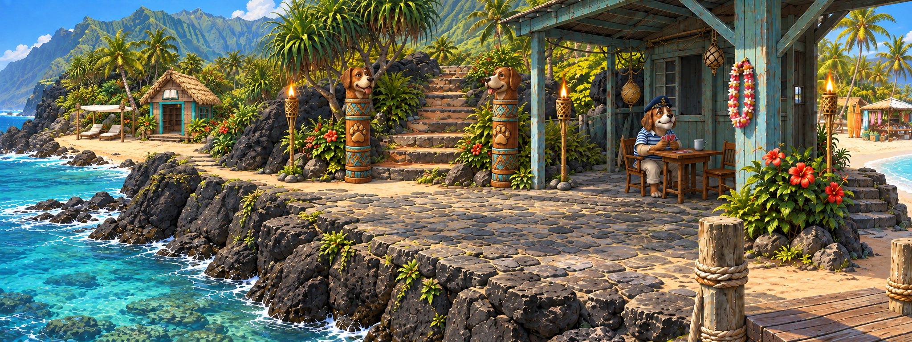
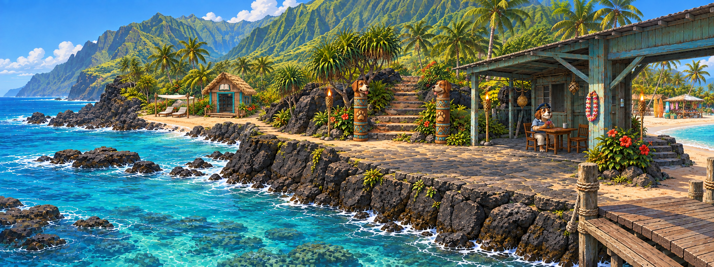

# Причал: три отдаления камеры

Все результаты — 2048 × 768, PNG. Встроенный ImageGen, отдельная генеративная правка для каждого плана; это не механические кропы одной картинки.

Лодка полностью убрана из кадра вместе с её швартовкой. Моряк под навесом, собачьи тотемы и факелы сохранены. Библиотека слева согласована с внешним видом из игрового `src/shared/assets/locations/tourist/cove.png`: соломенная крыша, бирюзовые стойки, знак книги и два лежака под светлым тентом на песчаном берегу. Интерьер `library.png` также проверен перед генерацией.

## 1. Близкий план



## 2. Средний план


## 3. Дальний план



Близкий план делает моряка и тотемы заметнее, средний балансирует персонажа и ландшафт, дальний раскрывает бухту. Это концепты для выбора: существующие игровые фоны и зоны клика не менялись. При подключении выбранного варианта понадобится согласовать hotspot-области.

## Общий промпт

```text
Use case: precise-object-edit.
Asset: three-distance study of a Hawaiian point-and-click adventure location, one complete panoramic image per request, 8:3.
Input 1 is the APPROVED SCENE and main edit target. Input 2 is the ACTUAL IN-GAME LIBRARY COVE architecture/environment reference ONLY. Do not copy reference 2 camera or turn the whole scene into the library close-up.
Required corrections in EVERY variant:
- The canoe has moved completely OUTSIDE THE CAMERA FRAME. Remove ALL visible boats, outriggers, canoe fragments, mooring ropes leading to boats, and the small boat mooring post on the central terrace. Reconstruct uninterrupted natural turquoise water and submerged reef where canoe was. The foreground must not imply a boat interaction. Do not add another boat elsewhere.
- Replace the mismatched distant open-front shed on the LEFT with the library cove from reference 2, seen from the main scene's appropriate distance and perspective: small enclosed warm plank hut, prominent steep thatched gable roof, turquoise door/window frames and upright posts, open entrance, small raised timber porch with a couple of shallow steps, OPEN BOOK pictogram on gable (no words). To the hut's LEFT in its own local cove are exactly TWO light padded wooden lounge chairs under one flat off-white fabric canopy supported by four simple posts, as in reference 2. Library and loungers are on a small sheltered SANDY COVE at water level, nestled among palms and vegetation, NOT on top of a bare high cliff. Gently adapt only the left shoreline to form this cove with a dry coastal footpath connecting it to the main stone terrace. The hut is background architecture, not a front-and-center new focal object. At distance simplify its details but preserve thatch/turquoise/book silhouette. No librarian visible on the overview.
Preserve the selected location's identity and relative geography: Hawaiian fluted green ridges, basalt shore and turquoise reef sea on LEFT, grey stone landing terrace, inland stone steps between exactly two dog-headed carved wooden totems in CENTER, THREE small lit bamboo torches, sea-green roofed boathouse veranda on RIGHT with the SAME elderly dog sailor in navy cap/striped shirt seated at his card table fully beneath the roof, tourist beach passage on far right, small section of near wooden pier. Exactly one sailor. No new interactions or unrelated props. All dry routes remain coherent and unobstructed.
Keep warm daytime light and polished painterly game illustration, readable silhouettes without microdetail noise, consistent architecture and anatomy. Do NOT reinvent the layout, change the camera DISTANCE as specified below. One continuous opaque panorama, no borders, labels, HUD or collage.
```

## Варианты камеры

### Близкий план

```text
CAMERA DISTANCE: closer than input 1, about 20% closer to the central terrace while maintaining the same oblique viewing direction. Move camera slightly along the landing toward the terrace, do not simply crop the image. Sailor under the canopy larger and readable (about 26% of frame height including seated body), dog totems around 35% image height. Keep all three route entrances visible; enough LEFT panorama remains to show the library cove in the left background, distinct thatched library and small white lounger canopy, not cut off. Less foreground water than original, a more intimate playable scene. Boathouse roof can be cropped at top/right similarly to input 1. No boat visible.
```

### Средний план

```text
CAMERA DISTANCE: same as input 1, preserve original framing and apparent sizes as closely as possible. This is the baseline corrected scene: sailor about 23% image height, both carved totems fully visible, broad central terrace and left foreground reef water. Library cove is left middle distance, its thatched roof, turquoise frames and white two-lounger canopy readable but not dominant. Do not move camera higher or rotate it. No boat visible.
```

### Дальний план

```text
CAMERA DISTANCE: pull camera BACK by about 45% along the same viewing direction, slightly higher only to keep terrace legible. A genuinely more distant establishing view of this same place, not a tight crop and not a new location. Show broader curved lava shoreline and more water/sky around the SAME terrace. Sailor and veranda recede (seated sailor about 14-16% image height, still identifiable), dog totems around 20-24% image height. Keep their relative positions and same architecture. The library cove is farther left in its own sandy bay, with small but recognizable thatched turquoise hut and pale two-lounger canopy. Preserve dry connecting path. A small pier slice may enter lower right, but no enormous foreground deck or new island. No boat anywhere in frame.
```

