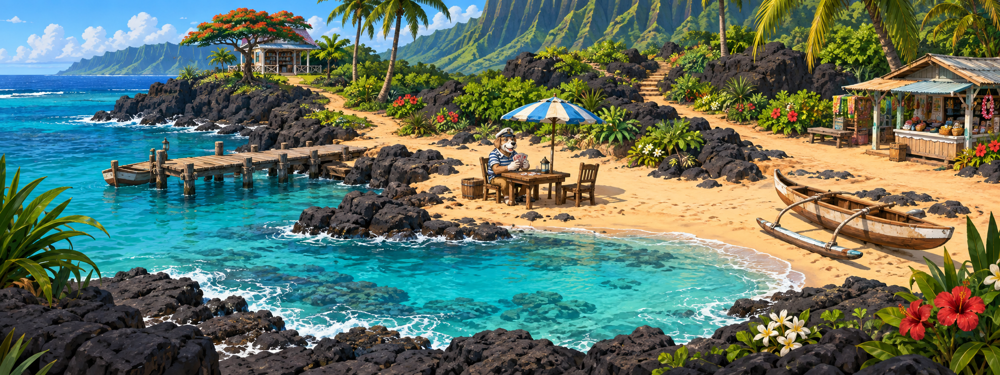
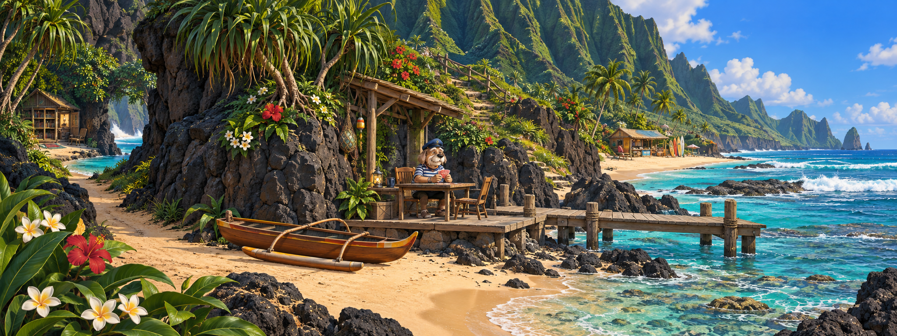
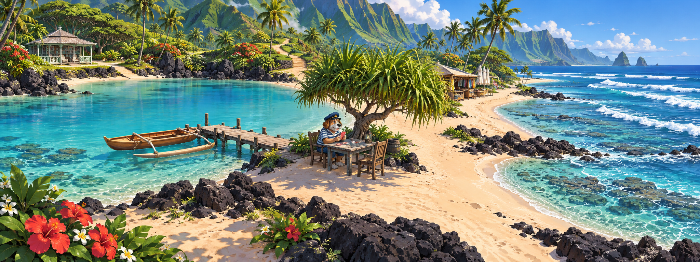
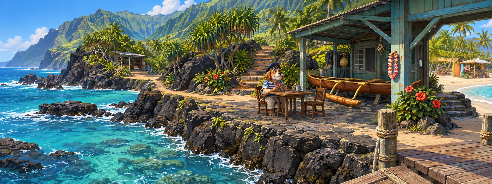
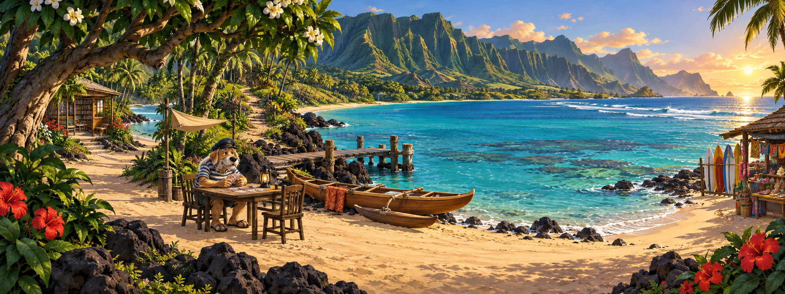

# Гавайский причал — смелые варианты, серия 2

Пять новых концептов по просьбе изменить не только декор, но и береговую линию с ракурсом камеры.
Гавайская тема усилена вулканическим берегом, рифами, складчатыми зелёными склонами, прибрежной растительностью, каноэ с балансиром и небольшими деревянными постройками. Это художественные сцены, не реконструкции конкретных мест.

## Варианты

### 1. Лавовая бухта сверху



Взгляд с невысокого уступа на изогнутую лавовую бухту. Тёмный передний план обрамляет бирюзовую воду; причал расположен сбоку.

### 2. У подножия зелёных скал



Низкий ракурс вдоль высоких зелёных скал. Камерный передний план у скалы, проход в тихую бухту слева, протяжённый пляж справа.

### 3. Коса между лагуной и океаном



Диагональная коса между лагуной и открытым океаном. Слева спокойная вода, справа прибой; моряк и боковой причал — в центре сухопутной части.

### 4. Причал на лавовом уступе



Боковой вид на лавовую террасу: море слева, лодочный сарай справа, причал входит в кадр из нижнего правого угла.

### 5. Большой изгиб гавайского берега



Взгляд с берега через широкую бухту на горы. Открытый морской центр композиции, моряк под деревом слева, тёплый вечерний свет.

## Игровая функция

Сохраняются моряк с карточной игрой, левое направление к тихой бухте/библиотеке, правое к туристическому пляжу/торговцу и проход вглубь острова. Точные координаты старых зон клика не сохранялись: для выбранной композиции потребуется перенастройка hotspot-областей и проверка панорамирования. В этой серии персонаж заново нарисован для концепта; финальную внешность моряка можно согласовать при подготовке игрового фона.

Рекомендация: №2 для камерного приключения у скал, №3 для наиболее выразительной береговой линии, №4 для необычного бокового ракурса.

## Файлы и статус

Все изображения сохранены рядом с этим документом. №2: 2046 × 768; остальные: 2048 × 768. Это исходные результаты генерации без растягивания; размеры перед подключением можно привести к формату проекта.
Фоны полноценные, непрозрачные. Требование прозрачной подложки для отдельных игровых тайлов остаётся неизменным.
Игровые ассеты и код не заменялись.

## Промпты

Использован встроенный ImageGen: пять отдельных генераций с нуля, без изображения старой композиции в качестве референса и без CLI/API fallback.

### Общий промпт

```text
Use case: stylized-concept.
Create ONE new 8:3 panoramic painted background concept for a HAWAIIAN dog-themed point-and-click adventure. Be bold and geographically distinctive, not a generic tropical island postcard. Charming polished hand-painted cartoon game art, readable large shapes, restrained microdetail, vivid turquoise and warm light. Hawaiian identity should be structural: dark volcanic basalt coastline, deeply fluted emerald volcanic ridges, reef shelves and Pacific surf, coastal hala and coconut palms, plumeria and red hibiscus in small purposeful clusters, modest plantation-era timber / open-sided local beach buildings, a wooden outrigger canoe with one lateral float and coherent supports. Do not add generic tiki idols or Asian pagodas.
Gameplay requirements: one elderly expressive anthropomorphic dog sailor with navy cap and striped shirt sitting at a card table, large enough to be a clickable NPC (roughly 15% image height), near the middle of the playable space. Three distinct dry walking exits: to a quiet cove/library on screen left, a tourist beach/merchant on screen right, and an inland uphill trail deeper into the scene. They can follow different elevations and curves; natural geography first. A small landing pier or shore landing must connect physically to dry ground, but MUST NOT be a centered frontal pier taking the whole bottom edge. No giant hut in the center, no symmetrical hut-shop-pier arrangement. Perspective and shoreline follow the variant below, not a fixed view. Moderate prop density, clear walkable ground. No lettering, signs, arrows, UI, collage, border or watermark. Complete opaque landscape background, not sprite. One continuous believable place, not several disconnected islands.

```

### 1. Лавовая бухта сверху

К общему промпту добавлено:

```text
CAMERA: standing on a low lava terrace, looking diagonally DOWN about 25 degrees across a hook-shaped black-basalt inlet; horizon confined to far upper left. BOLD SHORELINE: a deep turquoise finger of ocean enters from the left and hooks around the foreground lava shelf; a narrow crescent of warm sand occupies middle and right, surrounded by weathered black rock and hala trees. The short landing jetty lies almost SIDE-ON along the left middle waterline, connected to sand at its right end. Dog sailor/card table on a flat sandy shelf near x48%, under ONE small striped canvas parasol, no building behind him. Left dry path curls around back of the cove toward a low distant library; right sandy path follows a protruding basalt spur toward a tiny beach kiosk. Inland path climbs between black rocks at rear center-right, bright grassy volcanic ridges beyond. One beached outrigger canoe on right shore. Strong asymmetry, dark curved lava edge against luminous water, geographically cohesive.
```

### 2. У подножия зелёных скал

К общему промпту добавлено:

```text
CAMERA: low human eye height close to sand, wide cinematic oblique view ALONG a Hawaiian coast, looking subtly UP at towering vertically fluted green pali cliffs filling the LEFT half. Ocean with reef surf extends across RIGHT half into distance; skyline is sloped ridge versus open sky. BOLD SHORELINE: a narrow S-shaped golden beach winds from foreground center past a dark lava buttress to the distant right tourist beach; no centered hut. At center a dog sailor sits playing cards on a modest open-sided timber landing platform tucked beside the cliff, roof is tiny and offset, a short diagonal board landing extends from it toward the right water and is seen side-on. Left exit is a dry passage curving behind the lava buttress toward secluded library cove, visible as an inviting gap. Inland steps ascend naturally on the cliff base in the middle background, not a sheer impossible stair. Right route is continuous beach to one far beach shack with surfboards. Low canoe and plumeria near sailor; avoid large foreground occlusion. Grand cliffs, intimate playable foreground, distinct depth.
```

### 3. Коса между лагуной и океаном

К общему промпту добавлено:

```text
CAMERA: elevated from a gently rising beach trail, looking downward about 35 degrees, expansive panoramic establishing composition, not top-down map. BOLD SHORELINE: long diagonal sandy SPIT curves in a sweeping S from lower LEFT through CENTER toward upper RIGHT. Sheltered glassy aquamarine lagoon is inside the curve at LEFT, deep cobalt ocean and visible parallel reef breakers at RIGHT. The spit remains broad and safely walkable. A tiny lateral wooden jetty sticks LEFT from the center of the spit into the lagoon, NOT toward camera. Dog sailor/cards under shade of an isolated low hala tree near the central elbow, face visible in three-quarter view. A left branch of dry shore skirts the lagoon to a distant small library pavilion, right branch follows the spit to a modest tourist kiosk with folded parasols. Inland exit bends out from foreground-middle toward high green land at upper center-left. One moored Hawaiian outrigger canoe beside lateral jetty; low lava reef fingers and plumeria. Mostly sky/water/simple sand, a radically open blue composition with clear diagonal land connectivity, no big central hut.
```

### 4. Причал на лавовом уступе

К общему промпту добавлено:

```text
CAMERA: three-quarter SIDE VIEW from the end of a short landing at lower RIGHT, looking diagonally LEFT along an irregular low basalt coastal ledge, natural 28mm field of view without fisheye. Foreground wooden deck is only a small triangular slice in bottom-right, joined directly to a wide stone landing across center. BOLD SHORELINE: layered dark lava headlands project into teal coves at left; ocean occupies left foreground, while a steep green hillside sweeps up across right background. Dog sailor/card table near center on the stone terrace, shaded by low veranda of a small weathered sea-green Hawaiian plantation-era timber boathouse on RIGHT edge, not centered. A dry footpath on the ledge exits left into quiet cove behind a rocky headland. To the right, broad two-step descent curves behind the boathouse to sunny beach and modest tourist stand visible at far right. Inland path climbs gently rear-center through hala trees beside natural basalt rock, all levels physically connected. One canoe on a low rack, single hibiscus shrub, subtle lei hanging near sailor. Emphasize level changes and diagonal perspective with ocean negative space.
```

### 5. Большой изгиб гавайского берега

К общему промпту добавлено:

```text
CAMERA: viewpoint on the DRY BEACH looking seaward diagonally across a huge horseshoe bay, rotated nearly 90 degrees from a conventional pier-arrival view. Sea dominates CENTER and RIGHT, a majestic sweeping wall of deeply fluted emerald Hawaiian mountains rises across far left and background. BOLD SHORELINE: golden sand enters foreground right, curls across left middle under trees, then recedes in a long C-shaped bay toward distant right with reef surf. A simple short narrow jetty projects sideways from LEFT shoreline into center water, seen diagonally from shore, NEVER centered in bottom foreground. Dog sailor/card table on foreground dry sand center-left beneath spreading coastal tree with plumeria blooms, tiny canvas shade beside him. Left dry walking route goes behind tree toward quiet library cove (small partial low building), right route follows foreground shoreline toward colorful small beach stall on far right margin. Inland trail peels away through the grove near middle-left rear toward mountains, keep fork legible. Hawaiian outrigger canoe pulled fully above waterline near jetty, modest stacked surfboards at stall. Warm late afternoon directional sun, expansive atmospheric depth, little clutter, no building in central vista.
```

