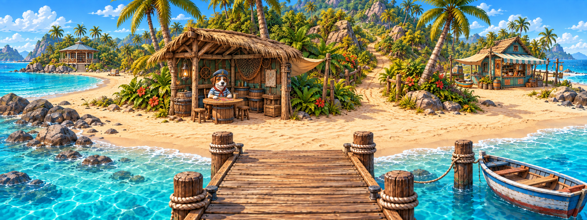
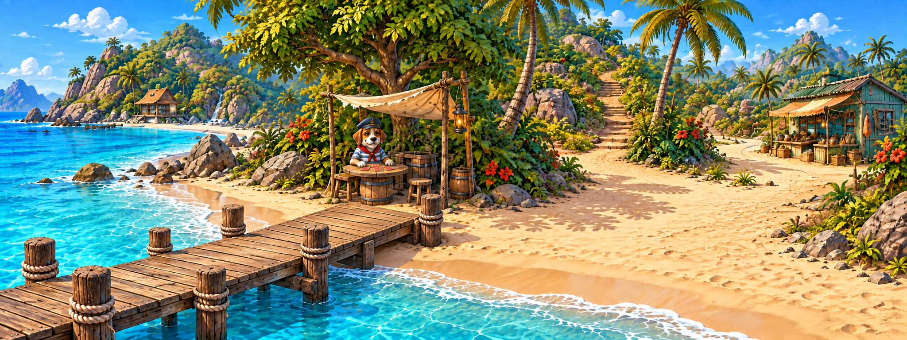
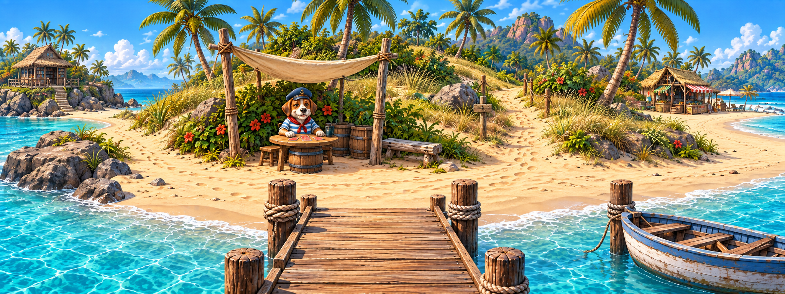
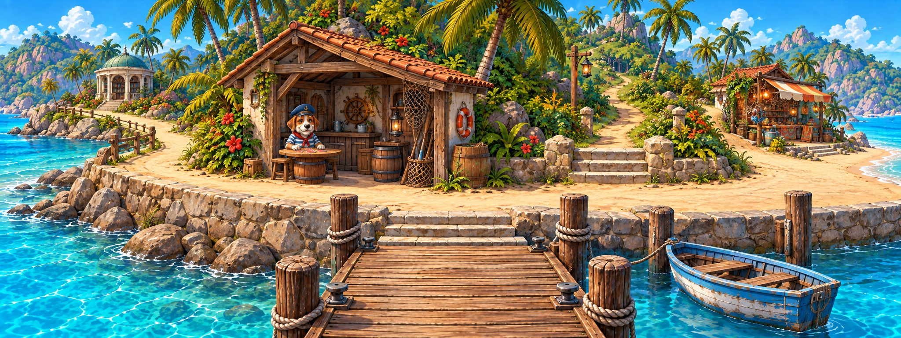
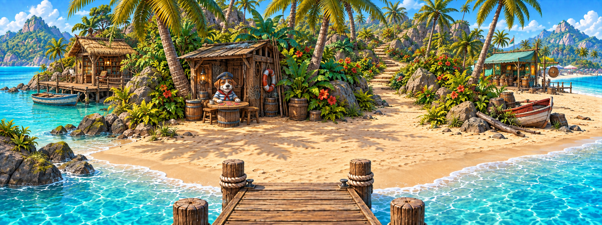

# Пять вариантов общего плана причала

## Что разобрано

Это локация `pier`, а не отдельный фон `tourist-beach`.
Текущая панорама: `src/shared/assets/locations/tourist/pier.png`, 2880 × 1080 (8:3).
Переходы описаны в `src/features/location-navigation/model/locations.ts`; диалог моряка — в `pierDialogues.ts`.

| Точка | Функция в игре |
| --- | --- |
| Слева | Тихая бухта, далее библиотека и её взаимодействия |
| Моряк | Диалог и запуск игры на поиск пар |
| Справа | Туристический пляж, далее торговец и игровой автомат |
| Вглубь острова | Открытие карты регионов; доступ зависит от наличия карты |

## Почему исходная композиция выглядит искусственно

Это визуальная оценка, а не ошибка навигации: крупная центральная постройка перетягивает внимание; ступени, настилы и берег тесно состыкованы; множество мелких объектов спорит с основными направлениями. Для сохранения механик не требуется сохранять эти постройки и их точные размеры.

В новых концептах оставлены четыре функциональные точки, единый берег и непрерывные пешеходные маршруты. Меняется тип пристани, объём архитектуры, рельеф и направление взгляда.

## Варианты

### 1. Берег полукруглой бухты



Ближе всего к исходной сцене: прямой причал, широкая дуга берега и небольшое укрытие моряка. Подходит для осторожного обновления композиции.

### 2. Прогулочная тропа вдоль берега



Асимметричный берег и диагональный причал. Море занимает левую часть, а торговая зона и подъём — правую. Убирает ощущение симметричной декорации.

### 3. Причал среди песчаных дюн



Самая спокойная композиция: низкие дюны, травы, навес вместо крупного здания. Много открытого песка, направления хорошо разделены.

### 4. Небольшая портовая площадка



Компактная пристань с каменной набережной и домиком лодочника. Более обжитое место с понятным переходом с настила на берег.

### 5. Лагуна и пальмовая роща



Лагуна и пальмовая роща. Тропы объединены открытой песчаной площадкой; библиотека и торговая зона читаются по краям.

## Как использовать

Это концепты для выбора, **не подключённые фоны**. Исходная сцена и код не заменялись.
Каждый PNG — 2048 × 768, соотношение сторон исходной панорамы сохранено.
После выбора необходимо перенести зоны клика под новую композицию и проверить панорамирование на узком экране: старые процентные координаты не совпадут автоматически.
Окончательный размер, детализацию моряка и стыковку с соседними локациями стоит довести на выбранном варианте.

Я бы начал с № 3 для более свободного, природного вида или № 2 для выразительной асимметрии.

Полные фоны непрозрачные намеренно; это не тайлы и не отдельные спрайты. Требование прозрачной подложки для игровых тайлов остаётся в силе.

## Генерация и воспроизводимость

Использован встроенный ImageGen, без CLI/API fallback. Пять отдельных генераций с исходным причалом в качестве референса стиля и персонажа. Второй вариант дополнительно отредактирован, чтобы причал непрерывно соединялся с сухим берегом.

### Общий промпт

```text
Use case: stylized-concept.
Asset type: alternative panoramic background concept for an existing tropical point-and-click adventure, one continuous wide landscape image, approximately 8:3 aspect ratio. Generate a new composition, do NOT copy the reference layout.
Input image: existing pier scene is a STYLE and CHARACTER reference only. Preserve the charming hand-painted cartoon adventure art, warm tropical daylight, blue-green water and expressive dog sailor. Improve physical plausibility and visual calm.
Gameplay invariants: player arrives from the shore end of a modest pier; clearly readable pedestrian route to a quiet cove/library at LEFT, route along the beach to a merchant/arcade at RIGHT, and a distinct walkable path uphill INTO the island in the middle-right background. Include one small elderly anthropomorphic dog boatswain in a blue nautical cap and striped shirt, seated at a simple card table in a sheltered shore-side spot near the middle-left, visibly available to talk. No other characters necessary. All four destinations must be distinguishable and reachable on foot, without routes crossing water or obstructed by objects.
Use consistent eye-level perspective and one continuous physically plausible shoreline and horizon. Realistic construction logic for any deck: straight boards, continuous railings only where needed, posts supporting the structure, sane stairs. Sparse purposeful props, irregular vegetation clusters with open sand between, simplified distant detail. Preserve quiet upper corners for overlaid HUD.
No text, no labels, no arrows, no HUD, no collage, no border, no duplicated buildings, no huge decorative totems, no stairway to nowhere, no fisheye, no tilt-shift, no fantasy floating terrain. This is a full painted environment background (opaque scene), not an isolated sprite or tile. Return one complete scene.
```

### Дополнения к общему промпту

#### 1. Берег полукруглой бухты

```text
Composition variant 1 — CRESCENT BAY: camera standing on a short straight timber pier approaching the sand, broad gently curving crescent beach stretches naturally left and right. A modest open-sided weathered timber shelter for the sailor at x42%, y55%, occupying only 15% of image width; its card table faces the viewer. Quiet cove curves away at left with one distant low library pavilion partly hidden by palms. To right, continuous dry sand leads past a small distant teal-trimmed merchant kiosk. Behind the landing, a sandy trail at x63% gently bends uphill between shrubs, no monumental staircase. Wide sky and sea glimpses either side. Scene feels like a real small island landing, open and airy, not a central symmetrical stage.
```

#### 2. Прогулочная тропа вдоль берега

```text
Composition variant 2 — COASTAL WALK: oblique eye-level view looking diagonally along a sandy beach, sea mostly on the LEFT, palms and a low vegetated bank on the RIGHT. A small simple landing jetty enters from lower left into a broad dry sandy path running across the scene. The LEFT branch curls back around a wooded headland to the quiet cove; the RIGHT branch passes a distant small teal timber shop beside the beach. A narrow but clearly walkable inland trail opens at x62% between the palms, going up gently. Boatswain sits at a card table beneath a broad shade tree and small simple canvas awning at x42% middle ground. Strong asymmetric diagonal composition, plenty of open sand, very little constructed decking, one coherent shoreline. Do not use a giant central hut.
```

#### 3. Причал среди песчаных дюн

```text
Composition variant 3 — LOW DUNES: view from a short timber landing toward a low sandy dune ridge covered with grasses and scattered coconut palms, ocean peeks through at the outer left and right. A broad naturally worn sandy clearing links the landing to two shoreline footpaths, LEFT toward a tranquil secluded library cove, RIGHT toward a sunlit tourist beach with a small distant merchant hut. An inland sandy trail passes through a shallow gap in the dunes near x62%, climbing gradually into foliage. Boatswain seated at a small card table in shade under a simple two-post canvas sail near x42%, framed by a modest driftwood bench. No big buildings in the foreground. Natural erosion, subtle footprints, restrained texture, airy sunlit grassland and sea, lower foliage density than other variants.
```

#### 4. Небольшая портовая площадка

```text
Composition variant 4 — SMALL HARBOR COURTYARD: from a single short jetty, player steps onto a compact level sandy landing beside a low weathered stone sea wall. One small boathouse tucked into the palm-covered bank near x42% has an open shaded porch where the dog boatswain sits at a card table. It occupies at most 20% of width. Low steps from the pier meet dry ground correctly. LEFT a continuous sand lane follows the seawall toward a secluded green cove and distant library pavilion; RIGHT a gently curving beach lane leads to a tiny colorful merchant kiosk. The inland route is a modest three-step stone entrance and winding dirt path at x65%, supported by the slope and disappearing naturally into palms. Intimate believable harbor, weathered plaster and stone with timber accents, no excessive rope ornament or complex intersecting piers.
```

#### 5. Лагуна и пальмовая роща

```text
Composition variant 5 — PALM GROVE LAGOON: eye-level panoramic composition viewed from the very shore end of a simple low landing deck, only a small strip of straight wooden boards visible at the bottom. Open sandy palm grove forms the central landing; an emerald lagoon and a sheltered quiet cove open on the LEFT, the busier sunny ocean beach and a small distant teal merchant shelter lie to RIGHT. One wide naturally worn footpath connects left and right across foreground dry sand, and a separate slender inland trail winds into the grove around x65%. Boatswain in clear shade at x43% sits at a simple card table beside a small low timber gear shed, not underneath a giant roof. Broad dappled palm shadows and clean patches of sand define space. Distinctive layered tropical garden composition, few strong silhouettes, natural shoreline and roots, all path surfaces connected and dry.
```

### Уточняющая правка второго варианта

```text
Use case: precise-object-edit. Input image is the EDIT TARGET. Fix only the physical connection between the wooden jetty in the lower left and the dry sandy shore: extend the far end of its wooden deck diagonally up and right until it firmly rests on the dry sand, forming a short continuous pedestrian landing. Remove the water gap that currently separates the end of the jetty from the beach. Add sensible supports and contact shadows where needed. Preserve the rest of the scene exactly: panorama aspect ratio, horizon, dog sailor under canvas shade, trees, left cove, right shop, inland stairs, painterly cartoon style and daylight. No text or UI. Return one complete panorama.
```

